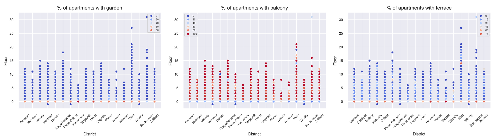
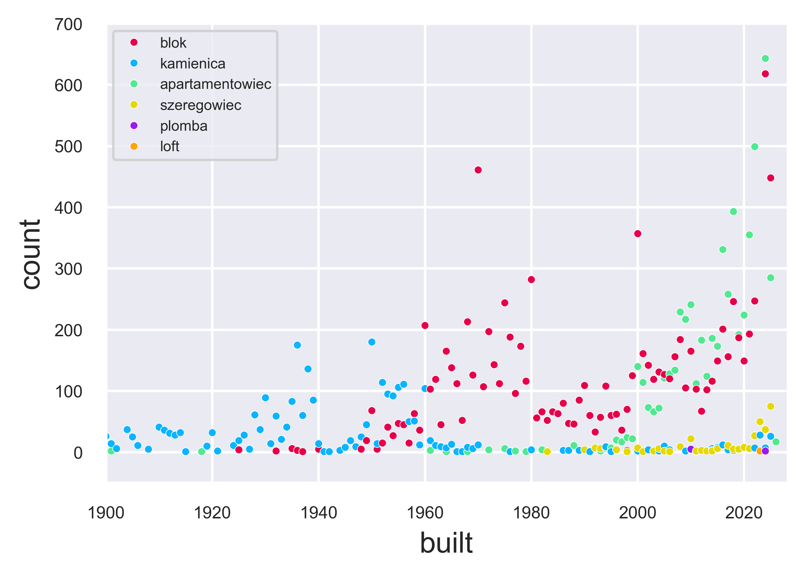
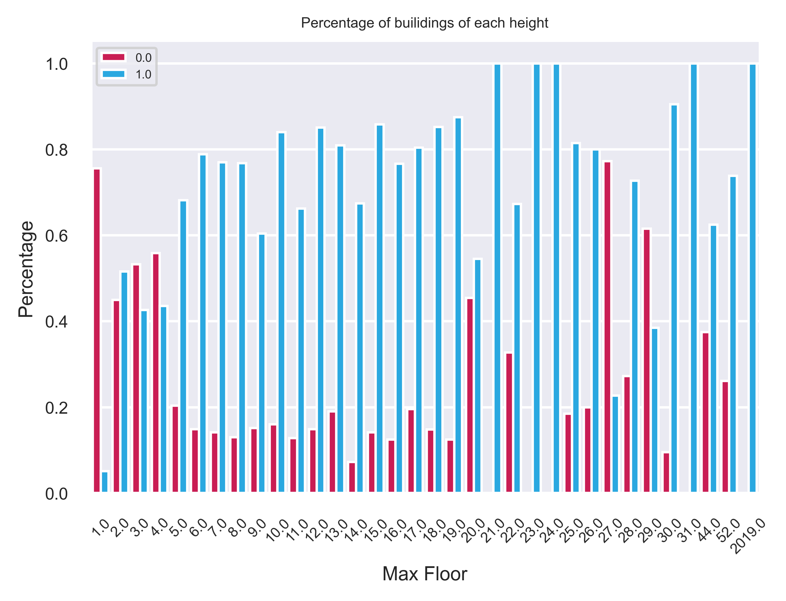

# Apartments Price Preditction - Results
### Goal
My goal was to build a model capable of predicting prices of apartments in Warsaw.

### Data Source
The data I will be using comes from Otodom website and I got it using my own [webscraper](https://github.com/mateuszel/otodom-datascraper).

### Data Cleaning and EDA
##### Formatting and cleaning the data
Most of the data included non-numeric characters, so I had to format it. This allowed me to find the amount of missing values in each column.
| Column | Missing Values |
| --- | ---: |
|total_price  |     2376|
|price_per_sqm  |   2376|
|area         |        0|
|rooms         |       0|
|finished      |   26232|
|floor         |     440|
|rent          |   16246|
|elevator      |    3892|
|built         |    7063|
|b_type        |    8209|
|link          |       0|
|max_floor     |    1260|
|balcony       |    8565|
|terrace       |    8565|
|garden        |    8565|
|street        |    7618|
|district      |     313|
|subdistrict   |     786|
|nbhood        |   19279|

##### Imputing missing values

Columns that had the most *NaN* values were entirely dropped and all rows with missing values in my target variable column were dropped aswell.

Methods of imputing missing values in selected columns:

* Values in column *rent* are strongly connected to 
both *area* and *district*, so I imputed missing values by calculating mean *rent_per_sqm* for each *district* and multiplying it by apartments *area*.
* For columns *balcony*, *terrace* and *garden* I was able to eliminate some incorrect data after plotting it:

After that I imputed missing values by calculating the probability of apartment having a *balcony* / *garden* / *terrace* base on its *district* and *floor*. 
* Plotting the relation between *b_type* and *built* allowed me to easily impute missing values based on corresponding *b_type* / *built* column since they are heavily related(as shown below).

* In *elevator* column after plotting the data I noticed some incorrext values. I've overriden the previous data by choosing what % of buildings of each height should have an elevator.

##### Feature Engineering
Initially I converted **location** column into four new ones: **district**, **subdistrct**, **nbhood**, **street** using ``Geopy``. According to my research, a column **distance** containing distances from apartments to city center is very useful. Because there was too many missing values in **nbood** and **street** I calculated the distances based on subdistrict*. Using ``Google GeoCoding API`` I extracted coordinates of each **subdistrict's** center, then for each apartment I set **distance** to Euclidean distance between its **subdistrict** center and city center + noise.

##### Outliers and incorrect values
My last step was handling outliers and looking for incorrect data. There weren't many outliers, some of them I handled one by one, some of them were dropped. The same goes for incorrect data. After that my dataset was ready for modelling. 
