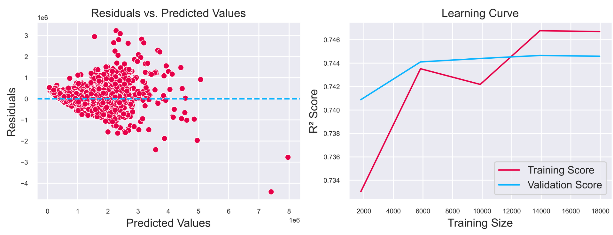
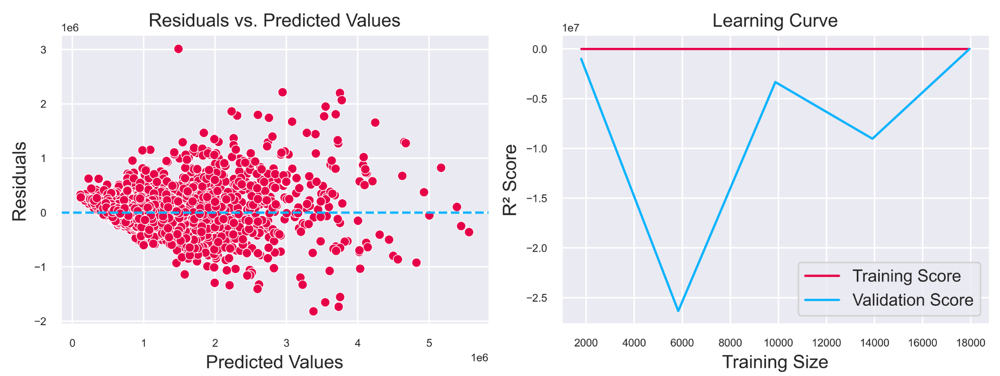
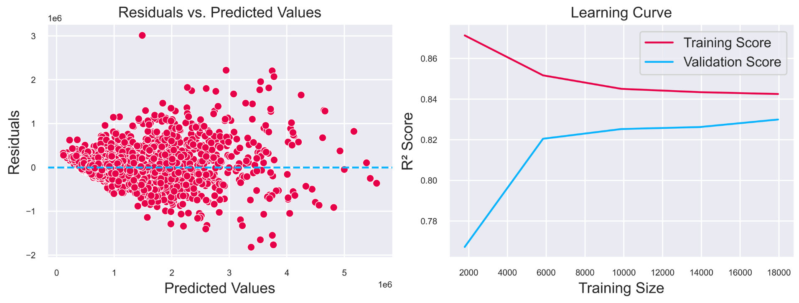
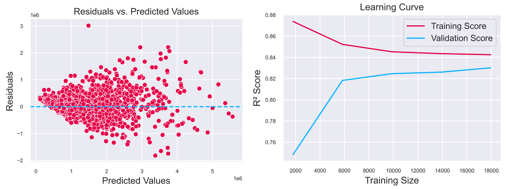
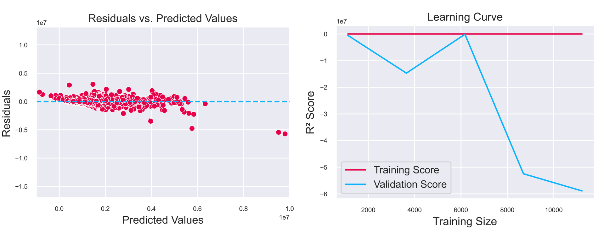
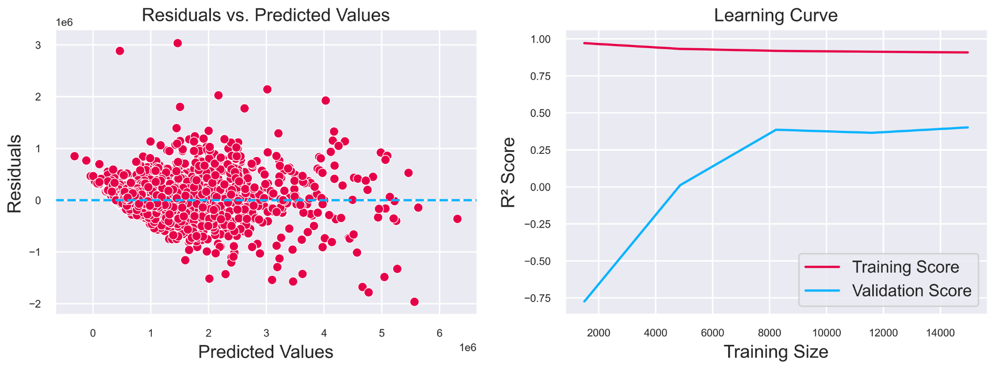
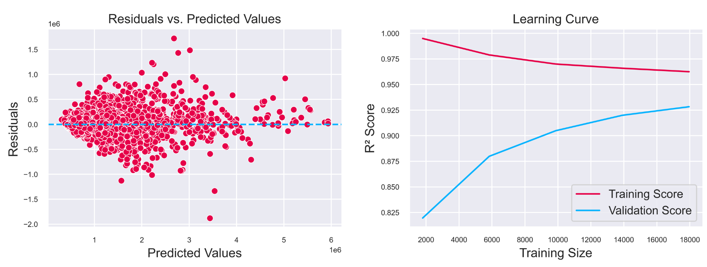
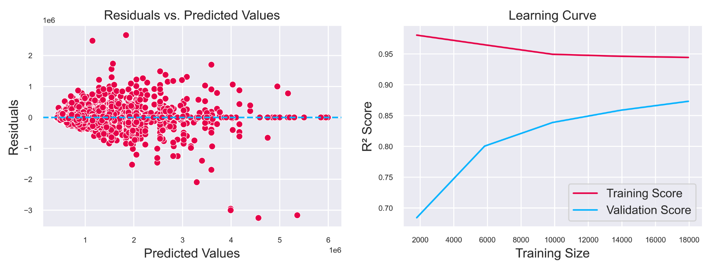
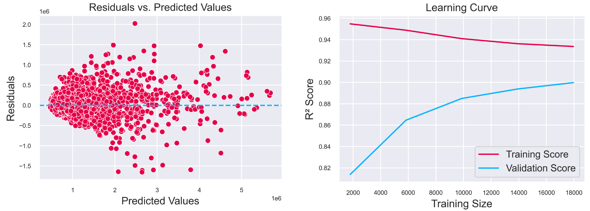

# Apartments Price Preditction - Results
### Goal
My goal was to build a model capable of predicting prices of apartments in Warsaw.

### Data Source
The data I will be using comes from Otodom website and I got it using my own [webscraper](https://github.com/mateuszel/otodom-datascraper).

### Data Cleaning and EDA (eda.ipynb)
#### Formatting and cleaning the data
Most of the data included non-numeric characters, so I had to format it. This allowed me to find the amount of missing values in each column.
| Column | Missing Values |
| --- | ---: |
|total_price  |     2376|
|price_per_sqm  |   2376|
|area         |        0|
|rooms         |       0|
|finished      |   26232|
|floor         |     440|
|rent          |   16246|
|elevator      |    3892|
|built         |    7063|
|b_type        |    8209|
|link          |       0|
|max_floor     |    1260|
|balcony       |    8565|
|terrace       |    8565|
|garden        |    8565|
|street        |    7618|
|district      |     313|
|subdistrict   |     786|
|nbhood        |   19279|

#### Imputing missing values

Columns that had the most *NaN* values were entirely dropped and all rows with missing values in my target variable column were dropped aswell.

Methods of imputing missing values in selected columns:

* Values in column **rent** are strongly connected to 
both **area* and *district**, so I imputed missing values by calculating mean **rent_per_sqm** for each **district** and multiplying it by apartments **area**.
* For columns **balcony**, **terrace** and **garden** I was able to eliminate some incorrect data after plotting it:

After that I imputed missing values by calculating the probability of apartment having a **balcony** / **garden** / **terrace** base on its **district** and **floor**. 
* Plotting the relation between **b_type** and **built** allowed me to easily impute missing values based on corresponding **b_type** / **built** column since they are heavily related(as shown below).

* In **elevator** column after plotting the data I noticed some incorrext values. I've overriden the previous data by choosing what % of buildings of each height should have an elevator.

#### Feature Engineering
Initially I converted **location** column into four new ones: **district**, **subdistrct**, **nbhood**, **street** using ``Geopy``. According to my research, a column **distance** containing distances from apartments to city center is very useful. Because there was too many missing values in **nbood** and **street** I calculated the distances based on subdistrict*. Using ``Google GeoCoding API`` I extracted coordinates of each **subdistrict's** center, then for each apartment I set **distance** to Euclidean distance between its **subdistrict** center and city center + noise.

#### Outliers and incorrect values
My last step was handling outliers and looking for incorrect data. There weren't many outliers, some of them I handled one by one, some of them were dropped. The same goes for incorrect data. After that my dataset was ready for modelling. 

### Training, testing and evaluating different models

#### Small updates to dataset
After preprocessing I was left with a dataset consisting of 13 features and just a little bit less than 30000 rows. \
My initial attempts at training models are described in ``model.ipynb``, however the results were not very good because of outliers, even though there weren't many of them. \
Getting more data to make models more accurate with outliers would be very time consuming, so I decided to drop 500 rows containing outliers. My work based on this dataset is described in ``model_no_outliers.ipynb``.

#### Algoritms used
Because of the small size of the dataset I was able to test multiple ML models in ``sklearn``:
* Linear Regression
* Ridge Regression
* Lasso Regression
* ElasticNet
* Polynomial Regression with:
    * Linear Regression
    * Ridge Regression
    * Lasso Regression
    * ElasticNet
* Gradient Boosting
* Regression Tree
* Random Forest

#### Encoding categorical features and scaling values
For features: **b_type** and **district** I used ``OneHotEncoding``.
For **rooms**, **floor**, **built**, **max_floor** I used ``OrdinalEncoding``, because values there can be 'ranked' and also because it doesn't increase dimensionality. \
Numerical features were scaled using ``StandardScaler``.

#### Linear Regression | Ridge Regression | Lasso Regression | ElasticNet with GridSearch

All these models performed very similarly, so I will only show results from Linear Regression.

| Metric  | Value                |
|---------|----------------------|
| MAE     | 213704.82419916763   |
| MSE     | 124225930474.904     |
| RMSE    | 352456.9909576259    |
| R²      | 0.7489847425925041   |

As we can see the model doesn't perform perfectly with RMSE being very high. However R² score implies that the model is reasonably well fit.

After inspecting these plots we can see that the model clearly has trouble with predicting apartments that have bigger value. \
Additionally we can see that the model generalises pretty well, but it's too simple to learn all paterns in data(slow growth of validation curve). \
Since the model is not overfitting it's not a surprise that Ridge, Lasso and ElasticNet provided the same results, I don't think it was neccessary to even test them. 

#### Polynomial Regression with degree=2

##### Polynomial Regression with Linear Regression

| Metric    | Value              |
|-----------|--------------------|
| MAE       | 175419.16          |
| MSE       | 81037210690.86     |
| RMSE      | 284670.35          |
| R²        | 0.8363             |

At first it looks like this model perform better than any previous ones. RMSE is lower and R^2 is higher. Let's take a look at residuals and learning curves. 

By looking at learning curves plot we can see that the model is massively overfitted. I'll check if applying regularization methods such as Ridge Regression or ElasticNet will help with overfitting.

##### Polynomial Regression with Ridge Regression

| Metric | Value           |
|--------|-----------------|
| MAE    | 175302.10853888627 |
| MSE    | 80995360301.71964 |
| RMSE   | 284596.83817941416 |
| R²     | 0.8363379437994527 |

The results are similar to previous model, let's see if the model is still overfitted. 

The model still has trouble with predicting larger values correctly, but it seems like it's not overfitted anymore. Cross Validation using KFolds confirms that. 

| Metric                         | Value               |
|--------------------------------|---------------------|
| Cross-Validation R² Scores     | 0.83633794, 0.82986827, 0.83086837, 0.82724198, 0.84016575 |
| Mean Cross-Validation R² Score | 0.832896461490891   |
| Standard Deviation              | 0.004689193688590963 |

##### Polynomial Regression with ElasticNet

| Metric   | Value               |
|----------|---------------------|
| MAE      | 175407.11463677013  |
| MSE      | 80828250968.84488   |
| RMSE     | 284303.09700888745  |
| R²       | 0.8366756107587292  |

Using ElasticNet slightly improved RMSE and R², while preventing overfitting(see plots below). However training and validating this model takes a lot of time.

#### Polynomial Regression with degree=3

##### Polynomial Regression with Linear Regression

| Metric   | Value               |
|----------|---------------------|
| MAE      | 165946.26930491923  |
| MSE      | 158481574608.6581   |
| RMSE     | 398097.4436098003   |
| R²       | 0.6797665906573818  |

This model takes much more computation time than previous ones and performs much worse. We can see a significant increase in RMSE and decrease in R². It is likely that the model is heavily overfitting the data because of its complexity. 

The above plots confirm that the model is overtfitted. Let's try using Ridge Regression to avoid that.

##### Polynomial Regression with Ridge Regression

| Metric   | Value               |
|----------|---------------------|
| MAE      | 152737.56249722146  |
| MSE      | 64101598369.04844   |
| RMSE     | 253182.93459285214  |
| R²       | 0.8704740696783173  |

This seems to be performing much better, it's also much faster to train. 

Even though the learning curves look better it's clear that the model is overfitting the data. So we can say that Polynomial Regression with degree=3 is too complex. 

#### Gradient Boosting

First, I found the optimal value of hyperparameter ``n_estimators = 1500``. Model trained with this value performs very well and is probably not overfitting.

| Metric   | Value               |
|----------|---------------------|
| MAE      | 112232.27444028766  |
| MSE      | 32012149872.516144  |
| RMSE     | 178919.394903169    |
| R²       | 0.9353151309899803  |

We can see a very big improvement in RMSE comparison to any previous model. 

The learning curves look rather healthy and show that the model is not overfitting(or it's overfitting a little). This model is the best so far, it's accurate and don't require a long training time. However I could've tuned other hyperparameters. 

#### Regression Tree

After trying multiple values of hyperparameter ``max_depth`` I decided that ``max_depth=11`` gives right balance between overfitting probability and accuracy.

| Metric | Value                |
|--------|----------------------|
| MAE    | 132525.4101994279    |
| MSE    | 59096443437.29667    |
| RMSE   | 243097.6006407646    |
| R²     | 0.8805876606874978   |

We can see that that this model is a little bit less accurate than model using Gradient Boosting. 

By examining the learning curves we can see that it's more probable that the model is overfitting than Gradient Boosting model is overfitting. 

#### Random Forest

After trying different values of hyperparameters I came up with following values: ``n_estimators=100``, ``max_depth=12``, ``min_samples_split=5``, ``max_leaf_nodes=200``.

| Metric | Value |
|--------|-------|
| MAE    | 147417.78 |
| MSE    | 51150205159.74 |
| RMSE   | 226164.11 |
| R²     | 0.8966 |

We can see that this model is slightly less accurate than the one using Gradient Boosting. However it's fitted better than Regression Tree model. 

### Summary

I think that even though some of the models performed very similarly, the two most interesting ones are models using Polynomial Regression with Ridge Regression and Gradient Boosting. \
Both of these models present acceptable accuracy and their training times are reasonable. \
While Gradient Boosting turned out to be more accurate, it's more likely that it's overfitting a little bit. \
I think that in order to make all of the above models more accurate, also on dataset with outliers, I need much more data, which is not so easy to get. 
